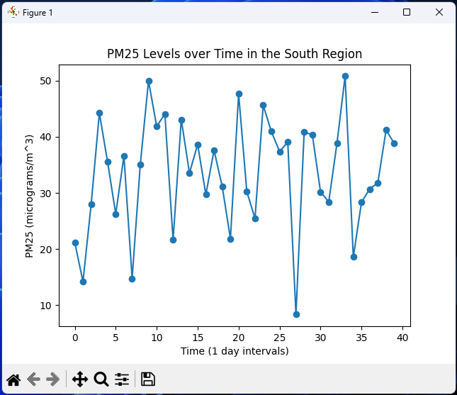

# About 
The aim of this individual assignment was for me to perform a statistical and mathematical analysis of a synthetic Smart City Environmental Monitoring dataset, giving me practical experience in extracting insights from large-scale urban sensor data. I presented my findings in the form of a consultancy-style analytical report, using clear visual representations and providing justification for my conclusions based on evidence from the dataset. 

The scenario was as follows: I was hired as a junior data analyst by a city s Smart Infrastructure Department to help assess environmental and traffic conditions across multiple regions. I was provided with a dataset containing information about traffic flow, PM2.5 pollution levels, noise measurements, temperature readings, day types, and geographical regions. My task was to explore and analyse this dataset to answer important operational questions, such as: 
- How pollution and noise levels varied across different regions of the city
- What time periods or areas experienced the highest traffic flow 
- Whether there was a measurable relationship between traffic volume and pollution 
- What patterns or anomalies in the data could help guide city planning decisions 

I also carried out mathematical modelling tasks, including predicting pollution levels using linear models, calculating probabilities of certain environmental conditions, and performing optimisation to identify the best allocation of limited city resources. The clarity, depth, and accuracy of my analysis determined the value of the recommendations I provided to the Smart City team.

# Preview
PM2.5 Levels Over Time in the Southern Region

<p align="center">
  
</p>

# How to run
### Prerequisites
- Python 3.10+
- Pandas Library (Install using: 'pip install pandas')
- Matplotlib Library (Install using: 'pip install matplotlib')

### Steps
- Clone the repository or just the .py files task2-task4 along with the csv file (dataset.csv)
- Run The Program Desired

# Key Libraries
- pandas
- matplotlib

## Project Structure
```
/Project
 ├──dataset.csv
 ├──DMA-CW-Task1-DataTypeIdentificationMarkdownCode.ipynb
 ├──DMA-CW-Task2-CentralTendencyAnalysis.py
 ├──DMA-CW-Task3-VariabilityAndDistribution.py
 ├──DMA-CW-Task4-TrendAnalysis.py
 ├──DMA-CW-Task5-Solving Systems of Equations.py
```
# License
MIT © 2026 Alex Pawlak
